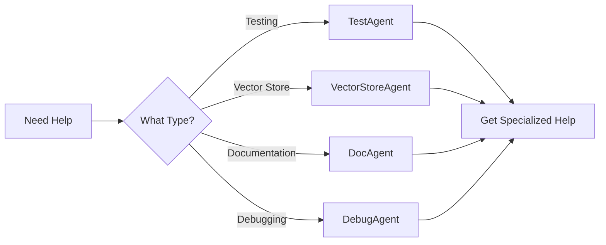

# Custom Agents for MCP Codebase Insight

This directory contains specialized AI agent instructions tailored for the MCP Codebase Insight project. Each agent has deep knowledge of specific aspects of the codebase and can help you work more effectively.

## Available Agents

### 🧪 [TestAgent](./TestAgent.agent.md)
**Expertise**: Testing, test runner, async test patterns, debugging test failures

**Use when:**
- Writing new tests for features or bug fixes
- Running tests with the custom test runner
- Debugging test failures, especially async/event loop issues
- Improving test coverage

**Key Knowledge:**
- Custom `./run_tests.py` test runner usage
- Test isolation and event loop management
- pytest-asyncio patterns and fixtures
- Component and integration test structures

---

### 🔍 [VectorStoreAgent](./VectorStoreAgent.agent.md)
**Expertise**: Qdrant vector store, embeddings, semantic search, performance optimization

**Use when:**
- Working with the vector store (add, search, update, delete)
- Managing embeddings and collections
- Optimizing vector search performance
- Debugging Qdrant connection issues

**Key Knowledge:**
- VectorStore and EmbeddingProvider APIs
- Qdrant version compatibility
- Batch operations and filters
- Performance best practices

---

### 📝 [DocAgent](./DocAgent.agent.md)
**Expertise**: Documentation, ADRs, API docs, code comments, architecture diagrams

**Use when:**
- Creating or updating documentation
- Writing Architecture Decision Records (ADRs)
- Documenting APIs and code examples
- Creating architecture diagrams

**Key Knowledge:**
- ADR management system
- Documentation structure and templates
- Docstring format (Google style)
- Mermaid diagram syntax

---

### 🐛 [DebugAgent](./DebugAgent.agent.md)
**Expertise**: Debugging, issue diagnosis, error handling, Agans' 9 Rules

**Use when:**
- Debugging complex issues systematically
- Handling async/event loop errors
- Diagnosing Qdrant connection problems
- Investigating memory leaks or resource issues

**Key Knowledge:**
- Agans' 9 Rules of Debugging
- Common async/event loop issues
- Configuration and environment problems
- Systematic debugging workflows

---

## How to Use These Agents

### In VS Code with GitHub Copilot

1. **Open the agent file** you need (e.g., `TestAgent.agent.md`)
2. **Reference it in Copilot Chat**: "Using @TestAgent, help me write tests for the new feature"
3. **Ask specific questions**: "How do I run integration tests in isolation?"

### In Claude or Other AI Tools

1. **Copy the agent content** into your conversation
2. **Provide context**: "I'm the TestAgent for this project..."
3. **Ask your question** in the same conversation

### General Workflow



## Agent Selection Guide

| Task | Recommended Agent | Why |
|------|------------------|-----|
| Write unit tests | TestAgent | Knows test patterns and runner |
| Fix failing tests | TestAgent + DebugAgent | Testing expertise + debugging |
| Add vector search | VectorStoreAgent | Deep Qdrant knowledge |
| Optimize queries | VectorStoreAgent | Performance expertise |
| Create ADR | DocAgent | ADR system expert |
| Update API docs | DocAgent | Documentation specialist |
| Debug async error | DebugAgent | Async troubleshooting expert |
| Qdrant won't connect | VectorStoreAgent + DebugAgent | Both have relevant knowledge |
| Memory leak | DebugAgent | Resource debugging specialist |

## Multi-Agent Collaboration

For complex tasks, you can use multiple agents:

**Example: Adding a New Feature**

1. **VectorStoreAgent**: Implement vector store operations
2. **TestAgent**: Write comprehensive tests
3. **DocAgent**: Document the feature and create ADR
4. **DebugAgent**: Help if issues arise during development

**Example Workflow:**

```bash
# 1. Implement feature with VectorStoreAgent
# "Help me add batch delete operation to VectorStore"

# 2. Write tests with TestAgent  
# "Create tests for the batch delete operation"

# 3. Debug issues with DebugAgent
# "Tests failing with event loop errors, help debug"

# 4. Document with DocAgent
# "Document the new batch delete feature and create an ADR"
```

## Creating Your Own Agent

If you need a specialized agent for a specific domain:

```markdown
# [YourAgent] Agent

You are a specialized [domain] agent for MCP Codebase Insight.

## Your Responsibilities
1. [Primary responsibility]
2. [Secondary responsibility]

## Critical Knowledge
- [Key concept 1]
- [Key concept 2]

## Common Operations
[Examples and patterns]

## When to Escalate
[Limitations and handoff criteria]
```

## Agent Updates

These agents are living documents. Update them when:
- New patterns emerge in the codebase
- Common issues are discovered and solved
- APIs change significantly
- New best practices are established

## Feedback

If an agent:
- Gives incorrect information → Update the agent file
- Is missing important context → Add it to the agent
- Doesn't cover your use case → Create a new agent or extend existing one

## Related

- [Main Copilot Instructions](../copilot-instructions.md) - General project guidance
- [Contributing Guide](../../CONTRIBUTING.md) - How to contribute
- [Testing Guide](../../docs/testing_guide.md) - Detailed testing information
- [Architecture Docs](../../docs/system_architecture/) - System design
