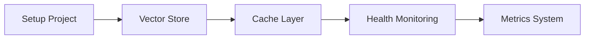
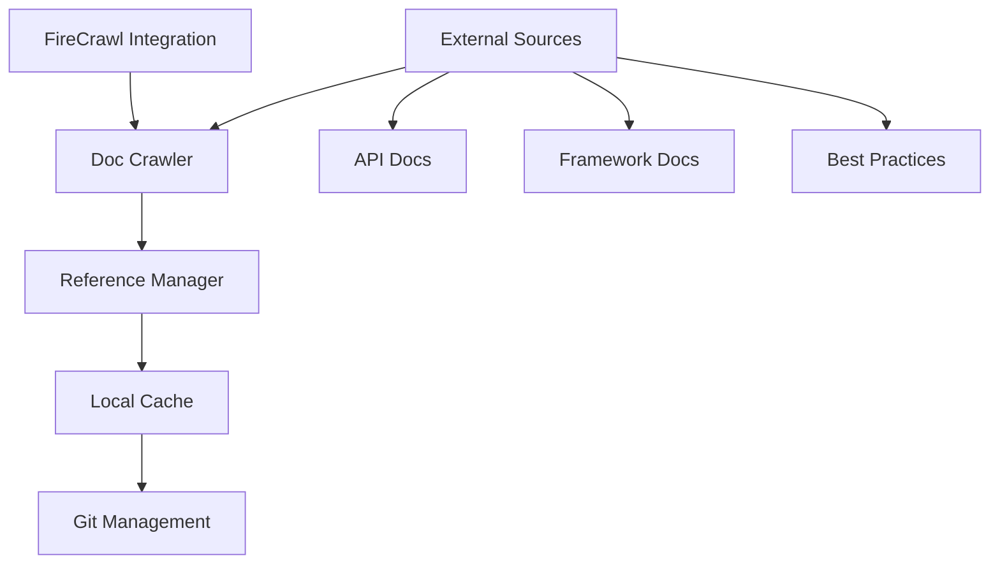
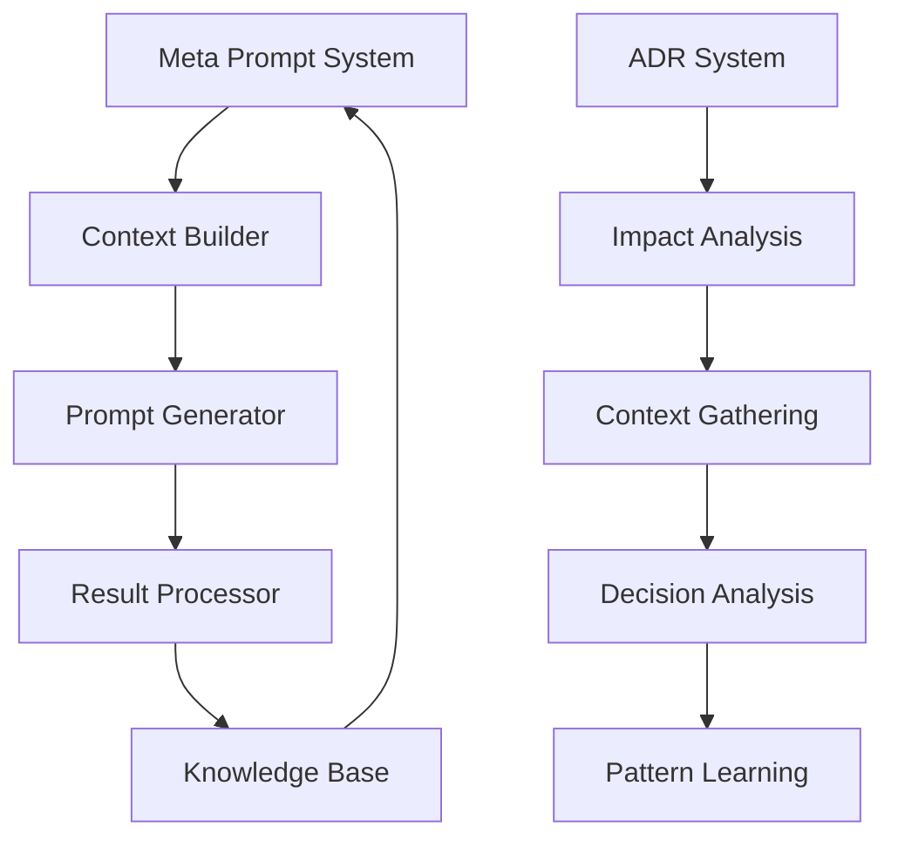
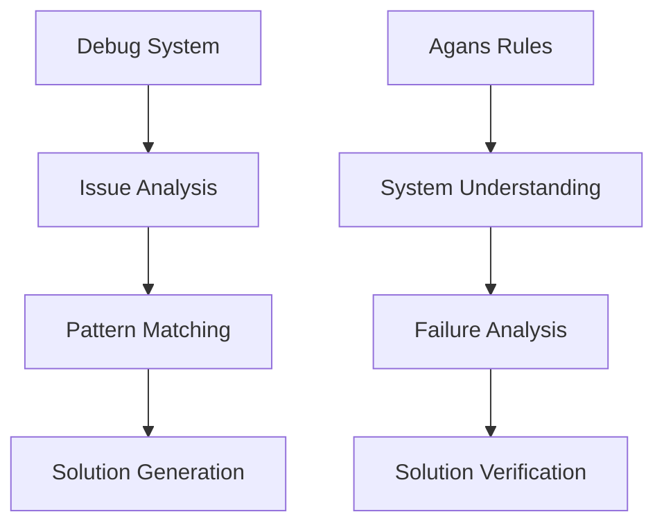

# Universal Codebase Analysis System Implementation Plan

## System Overview

```mermaid
graph TD
    subgraph Core Infrastructure
        A[MCP Server] --> B[Vector Store]
        A --> C[Cache System]
        A --> D[Metrics Collector]
        A --> E[Health Monitor]
    end

    subgraph LLM Integration
        F[Meta Prompt System] --> G[Context Builder]
        G --> H[Prompt Generator]
        H --> I[Result Processor]
        I --> J[Knowledge Updater]
    end

    subgraph Analysis Engine
        K[Code Analyzer] --> L[Pattern Detector]
        K --> M[Architecture Analyzer]
        K --> N[Security Analyzer]
        K --> O[Performance Analyzer]
    end

    subgraph Documentation System
        U[FireCrawl Integration] --> V[Doc Manager]
        V --> W[Reference Cache]
        V --> X[Git Integration]
    end

    subgraph Task Management
        P[Task Tracker] --> Q[Debug System]
        P --> R[Test Manager]
        P --> S[Doc Generator]
        P --> T[ADR Creator]
    end

    subgraph ADR System
        AA[Impact Analysis] --> AB[Context Gathering]
        AB --> AC[Decision Analysis]
        AC --> AD[ADR Generation]
        AD --> AE[Implementation Tracking]
        AE --> AF[Evolution Management]
    end
```



## Implementation Phases

### Phase 1: Core Infrastructure (Week 1-2)



#### Components:
1. **Vector Store**
   - Qdrant integration
   - Embedding system
   - Pattern storage
   - Search functionality

2. **Cache System**
   - LRU implementation
   - Result caching
   - Embedding cache
   - Performance optimization

3. **Health Monitor**
   - Component status
   - Performance metrics
   - Error tracking
   - System diagnostics

4. **Metrics Collector**
   - Usage statistics
   - Performance data
   - Error rates
   - Cache effectiveness

### Phase 2: Documentation & Knowledge Management (Week 3-4)



#### Components:
1. **Documentation Manager**
   ```python
   class DocumentationManager:
       async def crawl_docs(self, sources: List[str]) -> None:
           """Crawl and store documentation."""
           
       async def update_references(self) -> None:
           """Update local documentation cache."""
           
       async def manage_gitignore(self) -> None:
           """Handle version control for docs."""
   ```

2. **Reference System**
   ```python
   class ReferenceSystem:
       async def index_docs(self) -> None:
           """Index documentation for search."""
           
       async def find_relevant_docs(self, context: str) -> List[Doc]:
           """Find relevant documentation."""
   ```

### Phase 3: LLM Integration & ADR System (Week 5-6)



#### Components:
1. **Meta Prompt System**
   ```python
   class MetaPromptSystem:
       async def generate_prompt(self, task_type: str) -> str:
           """Generate task-specific prompts."""
           
       async def evolve_prompts(self, feedback: Dict[str, Any]) -> None:
           """Evolve prompts based on effectiveness."""
   ```

2. **ADR System**
   ```python
   class ADRSystem:
       async def analyze_impact(self, changes: CodeChanges) -> ImpactAnalysis:
           """Analyze architectural impact of changes."""
           
       async def gather_context(self) -> DecisionContext:
           """Gather relevant context for decision."""
           
       async def analyze_options(self, options: List[Option]) -> OptionsAnalysis:
           """Analyze and compare options."""
           
       async def generate_adr(self, context: DecisionContext) -> ADR:
           """Generate ADR document."""
           
       async def track_implementation(self, adr: ADR) -> Implementation:
           """Track ADR implementation."""
           
       async def evolve_adr(self, adr: ADR, feedback: Feedback) -> ADR:
           """Evolve ADR based on implementation feedback."""
           
       async def learn_patterns(self, adr: ADR) -> List[Pattern]:
           """Extract reusable patterns from ADR."""
   ```

### Phase 4: Debug & Analysis System (Week 7-8)



#### Components:
1. **Debug System**
   ```python
   class DebugSystem:
       async def analyze_issue(self, issue: Issue) -> Analysis:
           """Analyze using Agans' 9 Rules."""
           
       async def suggest_solution(self, analysis: Analysis) -> Solution:
           """Suggest solution approach."""
   ```

## Prompt Templates

### 1. Meta Prompts
```python
META_PROMPTS = {
    "task_analysis": """
    Given task: {task_description}
    Generate optimal analysis prompt considering:
    1. Required context
    2. Analysis steps
    3. Validation criteria
    4. Expected outcomes
    """,
    
    "prompt_evolution": """
    Original prompt: {original_prompt}
    Results: {results}
    Effectiveness: {metrics}
    
    Suggest improvements for:
    1. Context gathering
    2. Analysis depth
    3. Result quality
    4. Validation accuracy
    """
}
```

### 2. ADR Analysis Prompts
```python
ADR_PROMPTS = {
    "impact_analysis": """
    Code Changes:
    {code_changes}
    
    Current Architecture:
    {architecture_context}
    
    Historical Decisions:
    {related_adrs}
    
    Analyze:
    1. Architectural Impact
       - Component changes
       - Interface modifications
       - Dependency updates
    
    2. Technical Debt Impact
       - Existing debt affected
       - Potential new debt
       - Mitigation strategies
    
    3. Cross-cutting Concerns
       - Security implications
       - Performance impact
       - Scalability considerations
    """,
    
    "decision_analysis": """
    Decision Context:
    {decision_context}
    
    Options Considered:
    {options_analysis}
    
    Similar Decisions:
    {historical_decisions}
    
    Analyze each option for:
    1. Technical Alignment
       - Architecture fit
       - Technology stack
       - Development practices
    
    2. Business Impact
       - Development effort
       - Maintenance cost
       - Time to market
    
    3. Risk Assessment
       - Technical risks
       - Implementation risks
       - Operational risks
    """
}
```

### 3. Debug Analysis Prompts
```python
DEBUG_PROMPTS = {
    "debug_analysis": """
    Issue context: {issue_details}
    System state: {system_state}
    
    Following Agans' 9 Rules:
    1. System Understanding:
       - Current architecture
       - Component relationships
       - Expected behavior
    
    2. Failure Analysis:
       - Reproduction steps
       - Failure conditions
       - Pattern matching
    
    3. Observable Data:
       - Error logs
       - Stack traces
       - System metrics
    
    4. Component Isolation:
       - Affected components
       - Working components
       - Interface boundaries
    """
}
```

## Implementation Strategy

1. **Infrastructure First**
   - Set up core components
   - Establish monitoring
   - Implement caching
   - Configure vector store

2. **Documentation System**
   - Integrate FireCrawl
   - Set up reference management
   - Configure Git integration
   - Implement caching

3. **LLM & ADR Integration**
   - Implement meta prompt system
   - Build ADR analysis system
   - Create knowledge management
   - Set up learning loop

4. **Debug & Analysis**
   - Implement Agans' rules system
   - Add pattern detection
   - Create solution generation
   - Set up verification system

## Success Criteria

1. **System Performance**
   - Response time < 2s
   - Cache hit rate > 80%
   - Pattern match accuracy > 90%
   - System uptime > 99.9%

2. **Documentation Quality**
   - Reference freshness < 24h
   - Documentation coverage > 95%
   - ADR completeness > 90%
   - Test coverage > 85%

3. **Analysis Quality**
   - Pattern detection accuracy > 90%
   - Architecture analysis precision > 85%
   - Security issue detection > 95%
   - Performance insight accuracy > 85%

4. **ADR Quality**
   - Context completeness > 95%
   - Decision clarity > 90%
   - Implementation tracking > 85%
   - Evolution management > 90%

5. **Debug Effectiveness**
   - Issue resolution time < 24h
   - Solution accuracy > 90%
   - Pattern learning rate > 85%
   - Knowledge reuse > 80%

## Next Steps

1. Toggle to Act mode to begin implementation
2. Start with core infrastructure
3. Implement documentation system
4. Add LLM & ADR integration
5. Build debug & analysis components
6. Test and refine each component
7. Gather feedback and improve
