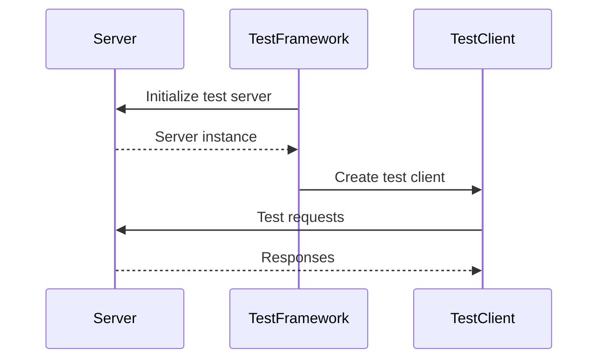
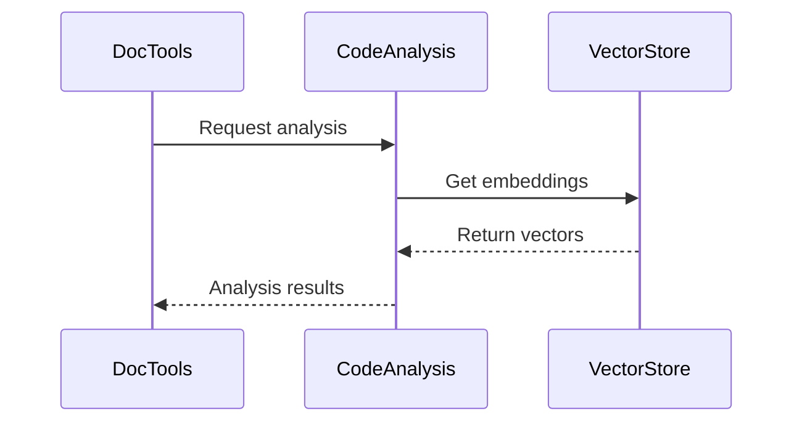

# Core Components Documentation

## Overview

This document details the core components of the MCP Codebase Insight system, their purposes, and interactions.

## Server Framework (`src/mcp_codebase_insight/server.py`)

### Purpose
Provides the main FastAPI server implementation for the MCP Codebase Insight system.

### Key Classes
- `CodebaseAnalysisServer`: Main server class
- `ServerConfig`: Configuration management
- Various request models for API endpoints

### Responsibilities
- API endpoint management
- Request validation
- Response formatting
- Server lifecycle management

## Testing Framework (`tests/framework/`)

### Purpose
Provides testing utilities and frameworks for system components.

### Key Components
- `ServerTestFramework`: Base testing infrastructure
- `SSETestManager`: SSE testing utilities
- Test fixtures and helpers

### Features
- Isolated test environments
- Component-level testing
- Integration test support
- Performance testing tools

## Documentation Tools (`src/mcp_codebase_insight/documentation/`)

### Purpose
Manages documentation generation, analysis, and maintenance.

### Key Components
- `DocNode`: Documentation node representation
- `DocumentationMap`: Documentation relationship tracking
- Documentation type system

### Features
- Documentation generation
- Relationship analysis
- Validation tools
- Integration with code analysis

## Implementation Details

### Server Framework Implementation
```python
# Key patterns and usage examples
from fastapi import FastAPI, Request
from pydantic import BaseModel

class ServerConfig:
    """Server configuration management"""
    def __init__(self):
        self.host = "localhost"
        self.port = 8000
        # ... other config

class CodebaseAnalysisServer:
    """Main server implementation"""
    def __init__(self, config: ServerConfig):
        self.app = FastAPI()
        self.config = config
        # ... setup routes and middleware
```

### Testing Framework Implementation
```python
# Key patterns and usage examples
import pytest
from typing import Generator

class ServerTestFramework:
    """Base testing infrastructure"""
    def __init__(self):
        self.test_client = None
        self.server_instance = None
        # ... setup test environment

class SSETestManager:
    """SSE testing utilities"""
    def __init__(self):
        self.connections = []
        self.events = []
        # ... SSE test setup
```

### Documentation Tools Implementation
```python
# Key patterns and usage examples
from pydantic import BaseModel
from enum import Enum

class DocumentationType(str, Enum):
    """Types of documentation nodes"""
    GUIDE = "guide"
    API = "api"
    ARCHITECTURE = "architecture"
    # ... other types

class DocNode(BaseModel):
    """Documentation node representation"""
    id: str
    type: DocumentationType
    content: str
    relationships: list
    # ... other fields
```

## Component Interactions

### Server-Testing Interaction


### Documentation-Analysis Interaction


## Best Practices

### Server Framework
1. Always use dependency injection
2. Implement proper error handling
3. Use async where appropriate
4. Maintain clear API documentation

### Testing Framework
1. Isolate test environments
2. Clean up resources after tests
3. Use appropriate fixtures
4. Implement proper assertions

### Documentation Tools
1. Maintain consistent formatting
2. Update relationships on changes
3. Validate documentation links
4. Keep documentation in sync with code

## Common Issues and Solutions

### Server Issues
- **Connection handling**: Implement proper connection management
- **Resource cleanup**: Use proper cleanup in middleware
- **Error propagation**: Implement consistent error handling

### Testing Issues
- **Test isolation**: Use proper fixture scope
- **Resource cleanup**: Implement cleanup fixtures
- **Async testing**: Use proper async fixtures

### Documentation Issues
- **Stale documentation**: Implement validation checks
- **Missing relationships**: Use automated scanning
- **Inconsistent formatting**: Use documentation linters

## Next Steps

1. **Server Framework**
   - Implement more robust health checks
   - Add performance monitoring
   - Enhance error handling

2. **Testing Framework**
   - Add more integration tests
   - Improve test coverage
   - Add performance benchmarks

3. **Documentation Tools**
   - Implement automated validation
   - Add relationship visualization
   - Improve search capabilities 