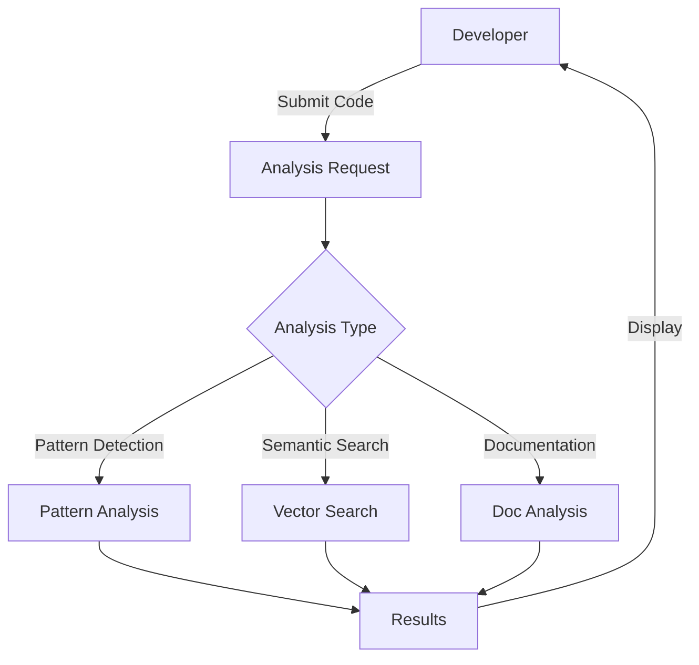
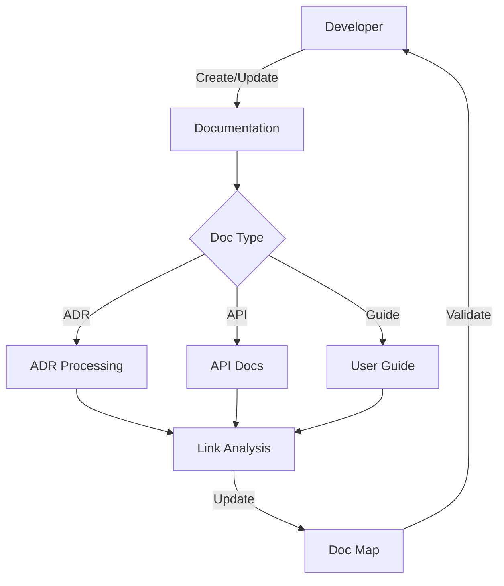
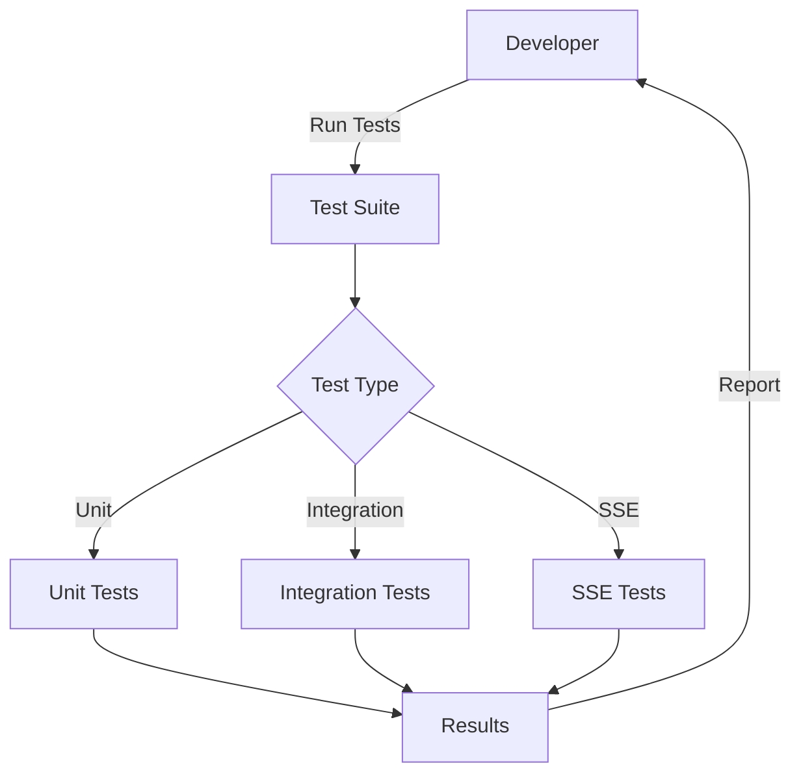
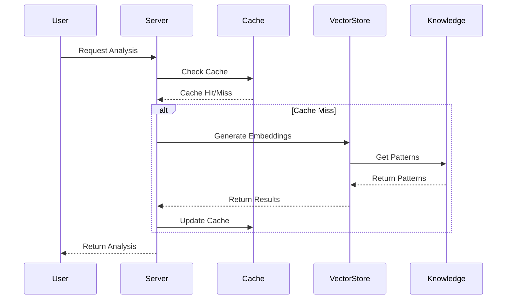
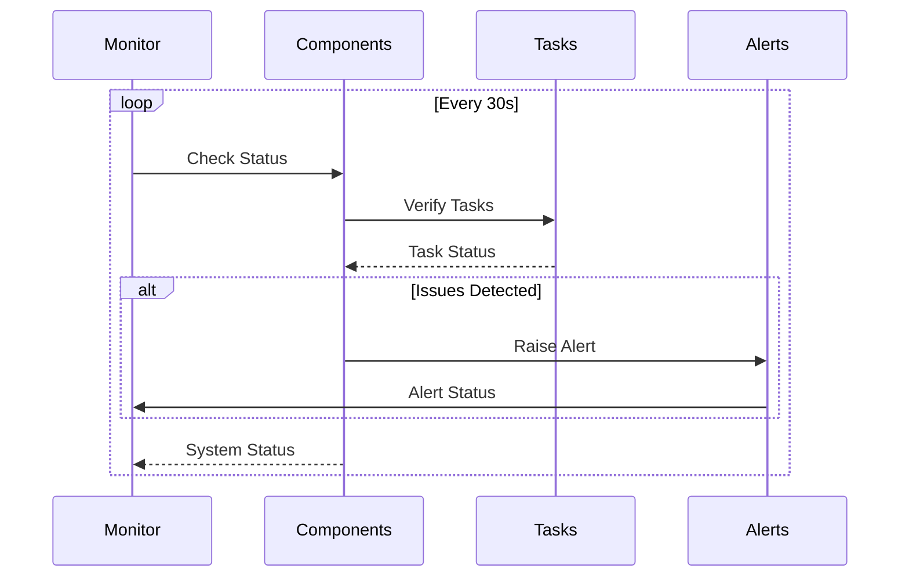

# MCP Codebase Insight Workflows

## Overview

This document details the various workflows supported by MCP Codebase Insight, including both user-facing and system-level processes.

## User Workflows

### 1. Code Analysis Workflow

#### Process Flow

#### Steps
1. **Submit Code**
   - Upload code files or provide repository URL
   - Specify analysis parameters
   - Set analysis scope

2. **Analysis Processing**
   - Pattern detection runs against known patterns
   - Semantic search finds similar code
   - Documentation analysis checks coverage

3. **Results Review**
   - View detected patterns
   - Review suggestions
   - Access related documentation

### 2. Documentation Management Workflow

#### Process Flow

#### Steps
1. **Create/Update Documentation**
   - Choose document type
   - Write content
   - Add metadata

2. **Processing**
   - Analyze document relationships
   - Update documentation map
   - Validate links

3. **Validation**
   - Check for broken links
   - Verify consistency
   - Update references

### 3. Testing Workflow

#### Process Flow

#### Steps
1. **Test Initialization**
   - Set up test environment
   - Configure test parameters
   - Prepare test data

2. **Test Execution**
   - Run selected test types
   - Monitor progress
   - Collect results

3. **Results Analysis**
   - Review test reports
   - Analyze failures
   - Generate coverage reports

## System Workflows

### 1. Vector Store Operations

#### Process Flow

#### Components
1. **Cache Layer**
   - In-memory cache for frequent requests
   - Disk cache for larger datasets
   - Cache invalidation strategy

2. **Vector Store**
   - Embedding generation
   - Vector search
   - Pattern matching

3. **Knowledge Base**
   - Pattern storage
   - Relationship tracking
   - Context management

### 2. Health Monitoring

#### Process Flow

#### Components
1. **Monitor**
   - Regular health checks
   - Performance monitoring
   - Resource tracking

2. **Components**
   - Service status
   - Resource usage
   - Error rates

3. **Tasks**
   - Task queue status
   - Processing rates
   - Error handling

4. **Alerts**
   - Alert generation
   - Notification routing
   - Alert history

## Integration Points

### 1. External Systems
- Version Control Systems
- CI/CD Pipelines
- Issue Tracking Systems
- Documentation Platforms

### 2. APIs
- REST API for main operations
- SSE for real-time updates
- WebSocket for bi-directional communication

### 3. Storage
- Vector Database (Qdrant)
- Cache Storage
- Document Storage

## Best Practices

### 1. Code Analysis
- Regular analysis scheduling
- Incremental analysis for large codebases
- Pattern customization

### 2. Documentation
- Consistent formatting
- Regular updates
- Link validation

### 3. Testing
- Comprehensive test coverage
- Regular test runs
- Performance benchmarking

## Troubleshooting

### Common Issues
1. **Analysis Failures**
   - Check input validation
   - Verify system resources
   - Review error logs

2. **Performance Issues**
   - Monitor cache hit rates
   - Check vector store performance
   - Review resource usage

3. **Integration Issues**
   - Verify API endpoints
   - Check authentication
   - Review connection settings

## Next Steps

1. **Workflow Optimization**
   - Performance improvements
   - Enhanced error handling
   - Better user feedback

2. **New Features**
   - Custom workflow creation
   - Advanced analysis options
   - Extended integration options

3. **Documentation**
   - Workflow examples
   - Integration guides
   - Troubleshooting guides 