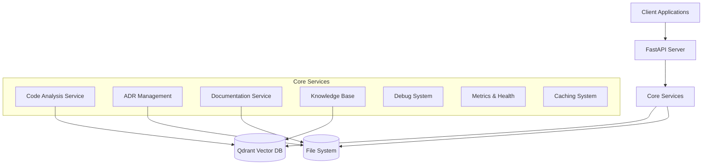
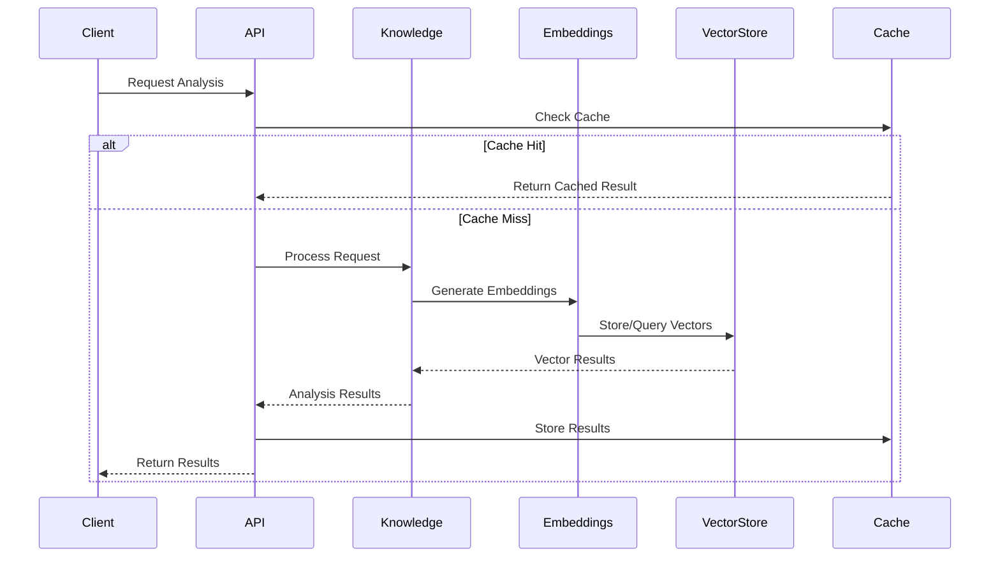
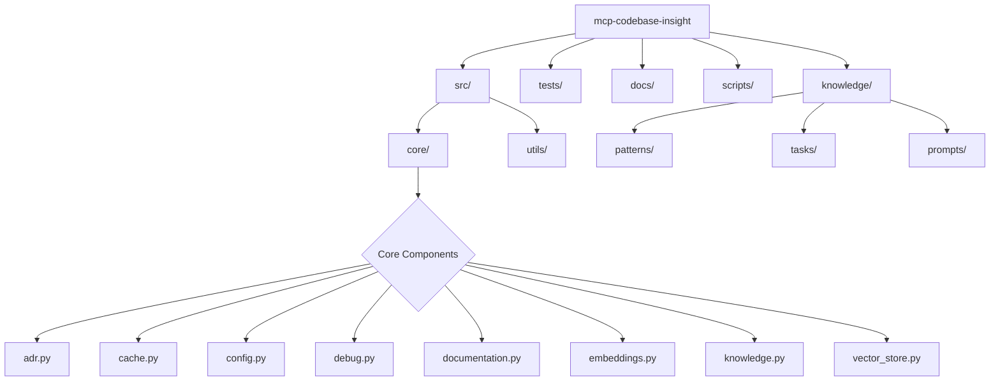
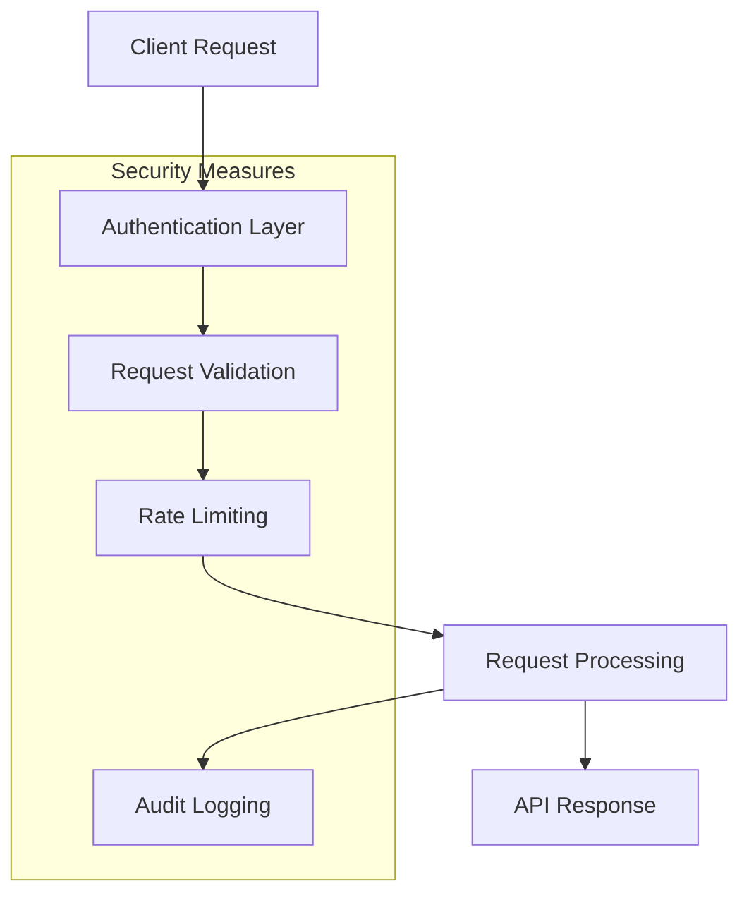

# System Architecture - MCP Codebase Insight

This document outlines the system architecture of the MCP Codebase Insight project using various diagrams to illustrate different aspects of the system.

## High-Level System Architecture



## Component Relationships

```mermaid
graph LR
    subgraph Core Components
        Embeddings[Embeddings Service]
        VectorStore[Vector Store Service]
        Knowledge[Knowledge Service]
        Tasks[Tasks Service]
        Prompts[Prompts Service]
        Debug[Debug Service]
        Health[Health Service]
        Config[Config Service]
        Cache[Cache Service]
    end
    
    Embeddings --> VectorStore
    Knowledge --> VectorStore
    Knowledge --> Embeddings
    Tasks --> Knowledge
    Debug --> Knowledge
    Prompts --> Tasks
    Health --> Cache
    Config --> |Configures| Core Components
```

## Data Flow Architecture



## Directory Structure



## Security and Authentication Flow



This architecture documentation illustrates the main components and their interactions within the MCP Codebase Insight system. The system is designed to be modular, scalable, and maintainable, with clear separation of concerns between different components.

Key architectural decisions:
1. Use of FastAPI for high-performance API endpoints
2. Vector database (Qdrant) for efficient similarity search
3. Modular core services for different functionalities
4. Caching layer for improved performance
5. Clear separation between data storage and business logic
6. Comprehensive security measures
7. Structured knowledge management system 