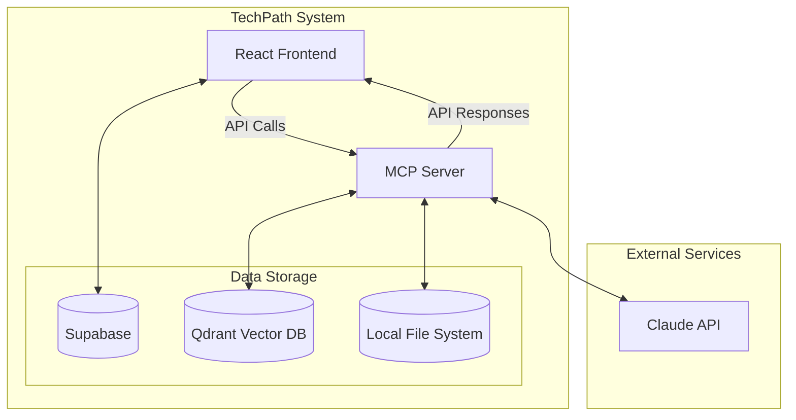
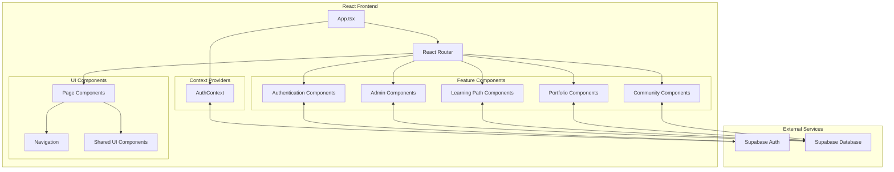
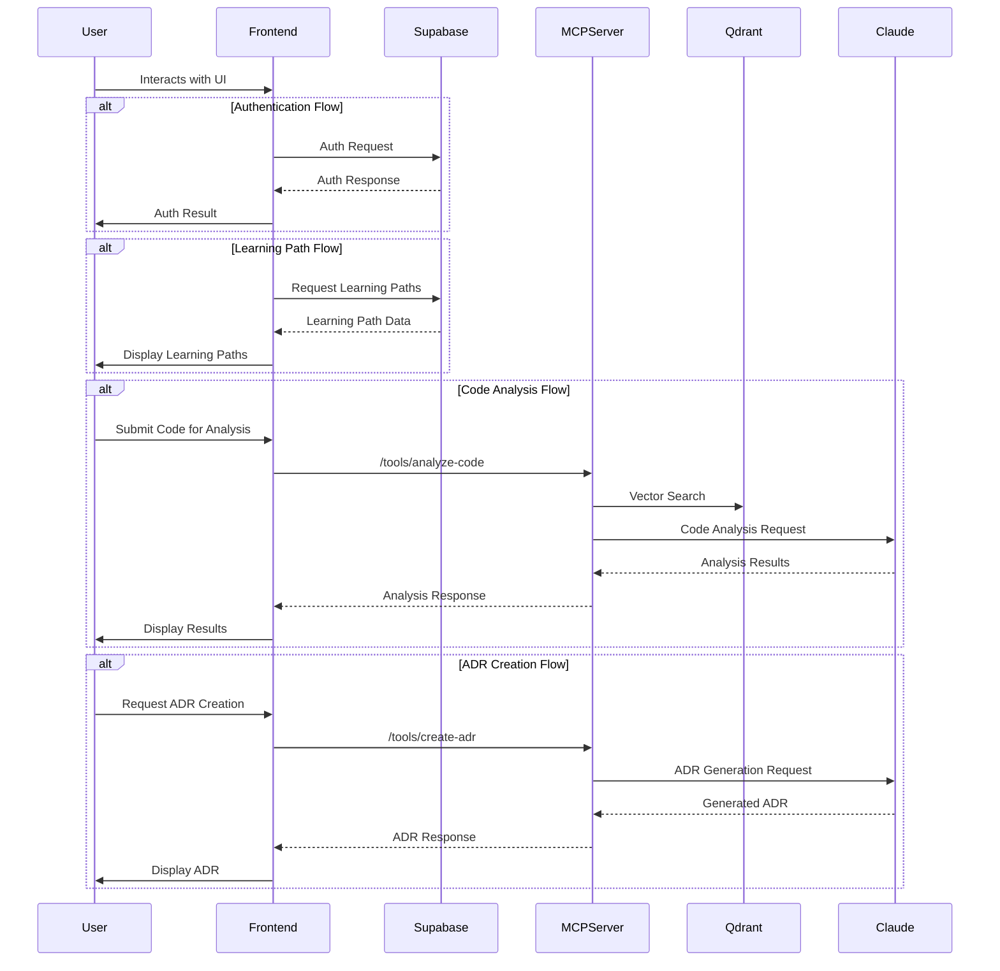

# TechPath System Architecture

This document outlines the architecture of the TechPath system, which consists of two main components:

1. A Python-based MCP (Model Context Protocol) server for codebase analysis
2. A React frontend web application for learning paths

## Overall System Architecture



## MCP Server Architecture

The MCP (Model Context Protocol) server provides advanced codebase analysis capabilities to LLMs like Claude. It integrates with Qdrant vector database for semantic search across codebases.

```mermaid
graph TD
    subgraph "MCP Server Core Infrastructure"
        Server[CodebaseAnalysisServer]
        FastAPI[FastAPI Application]
        Config[ServerConfig]
        
        Server --> FastAPI
        Server --> Config
        
        subgraph "Core Components"
            VectorStore[Vector Store]
            Embedder[Sentence Transformer]
            ADRManager[ADR Manager]
            DebugSystem[Debug System]
            DocManager[Documentation Manager]
            KnowledgeBase[Knowledge Base]
            PromptManager[Prompt Manager]
            TaskManager[Task Manager]
        end
        
        Server --> VectorStore
        Server --> Embedder
        Server --> ADRManager
        Server --> DebugSystem
        Server --> DocManager
        Server --> KnowledgeBase
        Server --> PromptManager
        Server --> TaskManager
        
        TaskManager --> ADRManager
        TaskManager --> DebugSystem
        TaskManager --> DocManager
        TaskManager --> KnowledgeBase
        TaskManager --> PromptManager
    end
    
    subgraph "MCP API Endpoints"
        AnalyzeCode[/tools/analyze-code]
        CreateADR[/tools/create-adr]
        DebugIssue[/tools/debug-issue]
        CrawlDocs[/tools/crawl-docs]
        SearchKnowledge[/tools/search-knowledge]
        GetTask[/tools/get-task]
    end
    
    FastAPI --> AnalyzeCode
    FastAPI --> CreateADR
    FastAPI --> DebugIssue
    FastAPI --> CrawlDocs
    FastAPI --> SearchKnowledge
    FastAPI --> GetTask
    
    AnalyzeCode --> TaskManager
    CreateADR --> TaskManager
    DebugIssue --> TaskManager
    CrawlDocs --> TaskManager
    SearchKnowledge --> KnowledgeBase
    GetTask --> TaskManager
    
    VectorStore <--> Qdrant[(Qdrant Database)]
    DocManager <--> FileSystem[(File System)]
    KnowledgeBase <--> FileSystem
    ADRManager <--> FileSystem
```

## React Frontend Architecture

The TechPath React frontend is a web application designed to provide users with curated learning paths and resources for various technologies, with user authentication, content management, and community features.



## Data Flow Architecture

This diagram shows how data flows between different components of the system.



## System Goals and Purpose

The TechPath system combines two distinct but complementary components:

1. **MCP Server (Backend)**:
   - Provides codebase analysis capabilities using vector search and LLM integration
   - Generates Architectural Decision Records (ADRs)
   - Offers systematic debugging using Agans' 9 Rules methodology
   - Manages technical documentation and knowledge retrieval
   - Serves as an AI-augmented development assistant

2. **React Frontend (Web Application)**:
   - Delivers structured learning paths for technology education
   - Manages user profiles and authentication
   - Provides portfolio showcase capabilities
   - Facilitates community interaction and networking
   - Offers administrative interfaces for content management

Together, these components create a comprehensive platform for both learning about technology and applying that knowledge in practical development scenarios with AI assistance.